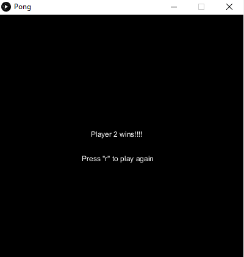
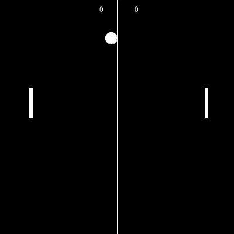

# CIU P1

## Autor
Francisco Jose Santana Sosa

## Descripción
Implementación de una versión de Pong en processing, que permite a dos jugadores jugar usando las teclas 'w' para subir y 's' para bajar en 
el caso del jugador de la izquierda y las teclas '&#8593;' para subir y '&#8595;' para bajar en el caso del jugador de la derecha. Además
cuando un jugador de los dos llega a la puntuación de 10 se muestra una pantalla diciendo que jugador ha ganado y permite volver a jugar pulsando la 
tecla 'r'.

## Referencias
Guión de prácticas.

[Sonido usado](https://freewavesamples.com/alesis-fusion-acoustic-bass-c2)

## Muestra de ejecución

